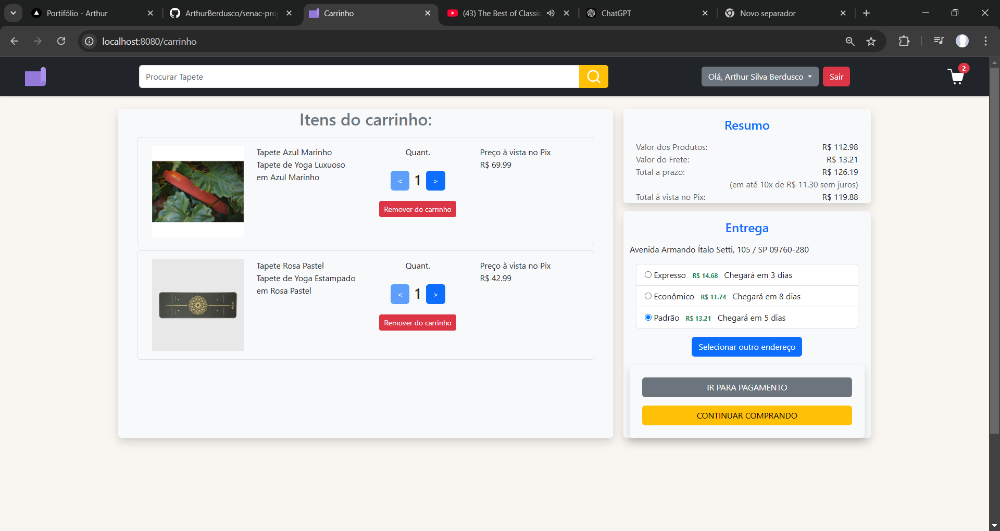

# 🛍️ Harmony eCommerce 


Harmony é uma aplicação de e-commerce desenvolvida como um projeto acadêmico colaborativo. O sistema abrange desde a administração de produtos e pedidos até a experiência de compra de usuários, oferecendo uma plataforma completa e funcional.  

## 👫 Equipe

- **Arthur Silva**  
- **Kayke**  
- **Cintia**  
- **Juan Caleb**

## 🚀 Tecnologias Utilizadas

- **Backend**: Java Spring Boot  
- **Frontend**: Thymeleaf, HTML, CSS, JavaScript  
- **Banco de Dados**: MySQL
- **Arquitetura**: Padrão MVC com Spring Security  

---

## 🎯 Funcionalidades

### 🔒 Backoffice

O sistema backoffice é responsável pelo gerenciamento completo do e-commerce. Ele inclui:  
- **Controle de operadores** (estoquista ou administrador).  
- **Gestão de produtos**, incluindo controle de estoque.  
- **Gerenciamento de pedidos**, com alteração de status.

| Tela Principal | Produtos | Pedidos |
|----------------|----------|---------|
|  |  |  |

| Editar Produto | Editar Pedido | Editar Usuário |
|----------------|---------------|----------------|
|  |  |  |

---

### 🛒 Loja Virtual

Na loja virtual, o usuário tem acesso a uma experiência completa de compra, incluindo:  
1. **Exibição de produtos com carrossel de imagens.**  
2. **Controle de carrinho e cálculo de frete.**  
3. **Páginas de pagamento e resumo do pedido.**  
4. **Visualização de pedidos e detalhes.**

| Tela Produto | Carrinho | Forma de Pagamento |
|--------------|----------|--------------------|
|  |  |  |

| Resumo do Pedido | Meus Pedidos | Detalhe do Pedido |
|------------------|-------------|-------------------|
|  |  |  |

---

## 🔐 Segurança

Implementamos autenticação e autorização com **Spring Security**, garantindo um controle de acesso robusto para operadores e usuários.

---

## 📁 Estrutura do Projeto

O projeto segue o padrão de arquitetura **MVC (Model-View-Controller)**, garantindo separação clara de responsabilidades entre as camadas:  

- **Model**: Representação das entidades do sistema, como Produtos e Pedidos.  
- **View**: Construída com Thymeleaf, para renderização dinâmica.  
- **Controller**: Gerencia as requisições HTTP e conecta a View ao Model.  

---

## 📦 Como Executar o Projeto

1. Clone o repositório:  
   ```bash
   git clone https://github.com/usuario/harmony-ecommerce.git
